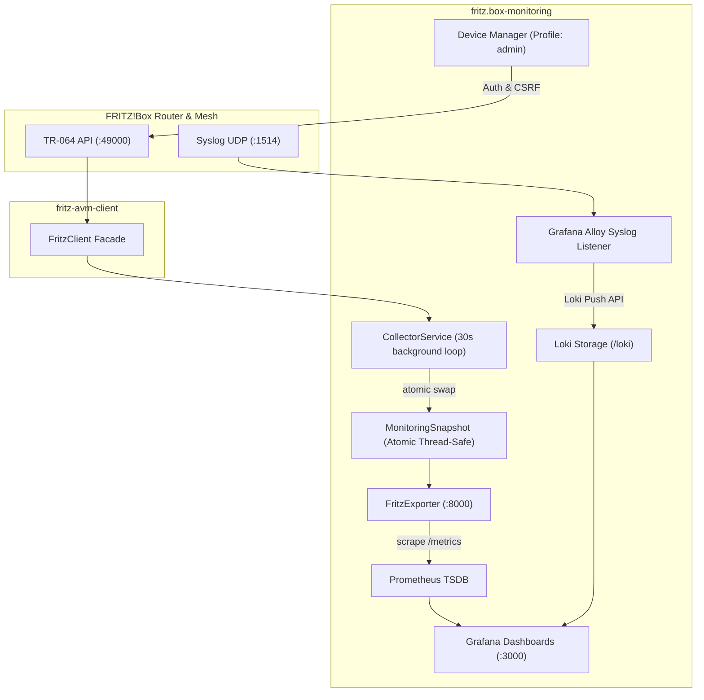

# Architecture Documentation

## Overview

The `fritz.box-monitoring` stack provides a production-grade, secure, and observable monitoring pipeline for AVM FRITZ!Box routers, mesh repeaters, and powerline adapters.

The system is decoupled into two independent pathways:

1. **Metrics Pipeline**: Asynchronous TR-064 metrics polling via `fritz-avm-client` -> `CollectorService` -> `FritzExporter` -> `Prometheus` -> `Grafana`.
2. **Logging Pipeline**: Native RFC3164 Syslog UDP ingestion -> `Grafana Alloy` -> `Loki` -> `Grafana`.

---

## Data Flow Architecture

---

## Key Architectural Principles

1. **Single Client SDK**: All TR-064 interactions rely exclusively on `fritz-avm-client`. No duplicated TR-064 code exists inside `fritz.box-monitoring`.
2. **Decoupled Scraping**: Prometheus scrapes `/metrics` directly from `FritzExporter`'s latest atomic in-memory snapshot. Prometheus scrapes do not trigger synchronous TR-064 calls.
3. **No Direct TR-064 Scraping**: Prometheus never scrapes TR-064 port `49000` directly. The legacy `mesh_discovery` container is removed.
4. **Alloy Syslog Ingestion**: Log polling and `promtail` are removed. FRITZ!Box syslog messages are ingested via Grafana Alloy UDP listener (`loki.source.syslog`).
5. **Security & Least Privilege**: Non-root containers, dropped capabilities (`ALL`), read-only file mounts, and Docker Secrets. Admin operations (`device_manager`) are isolated in the `admin` compose profile and secured with HTTP Basic/Session auth, CSRF tokens, and MAC address validation.
