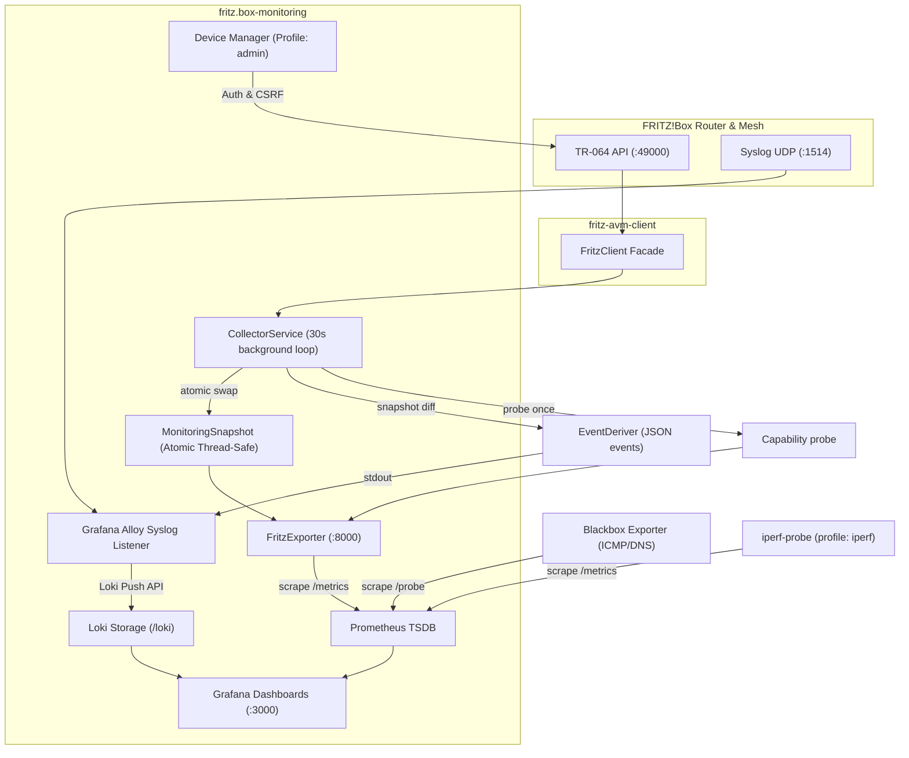

# Architecture Documentation

## Overview

The `fritz.box-monitoring` stack provides a production-grade, secure, and observable monitoring pipeline for AVM FRITZ!Box routers, mesh repeaters, and powerline adapters.

The system is decoupled into independent pathways:

1. **Metrics Pipeline**: Asynchronous TR-064 metrics polling via `fritz-avm-client` -> `CollectorService` -> `FritzExporter` -> `Prometheus` -> `Grafana`.
2. **Logging Pipeline**: RFC3164 Syslog UDP + Docker container logs -> `Grafana Alloy` (scoped to this compose project via `discovery.relabel`) -> `Loki` -> `Grafana`.
3. **Active Probing** (P1): `Blackbox Exporter` runs ICMP + DNS probes against LAN infrastructure, WAN anchors and resolvers; targets in `config/blackbox/targets/*.yml` (`file_sd`, hot-reloaded).
4. **Derived Events** (P2): `EventDeriver` diffs consecutive snapshots and emits structured JSON events on the exporter's stdout; Alloy ships them to Loki (the FRITZ device log itself is permission-gated).
5. **Capability Probing**: `capabilities.probe_capabilities()` actively tests the permission-gated TR-064 actions once and exposes `fritz_capability_available{feature}` so degraded data is visible and diagnosable (see `docs/fritz-permissions.md`).
6. **Optional** (`--profile iperf`): `iperf-probe` runs a short, interval-floored `iperf3` client test against a wired LAN host for LAN-vs-WAN reference.

Recording + alerting rules live in `config/prometheus/rules/` (WAN utilisation, flap statistics, mesh backhaul health, probe latency/loss/jitter, capability, DNS). Grafana dashboards are provisioned from `config/grafana/provisioning/dashboards_files/` — see `docs/dashboards.md`.

---

## Data Flow Architecture

---

## Key Architectural Principles

1. **Single Client SDK**: All TR-064 interactions rely exclusively on `fritz-avm-client`. No duplicated TR-064 code exists inside `fritz.box-monitoring`.
2. **Decoupled Scraping**: Prometheus scrapes `/metrics` directly from `FritzExporter`'s latest atomic in-memory snapshot. Prometheus scrapes do not trigger synchronous TR-064 calls.
3. **No Direct TR-064 Scraping**: Prometheus never scrapes TR-064 port `49000` directly. The legacy `mesh_discovery` container is removed.
4. **Alloy Ingestion**: FRITZ!Box syslog (`loki.source.syslog`) and this project's container logs (`loki.source.docker`, scoped by `discovery.relabel` to `com.docker.compose.project =~ fritz-monitoring-.*`) are pushed to Loki.
5. **Measure, don't guess**: New metrics are classified `AVAILABLE` / `DERIVED` / `NOT_AVAILABLE`; permission-gated features are probed and surfaced (`fritz_capability_available`) rather than silently degraded. Active latency/loss come from real probes, not fabricated from state samples.
6. **Security & Least Privilege**: Non-root containers, dropped capabilities (`ALL`), read-only file mounts, and Docker Secrets. Admin operations (`device_manager`) are isolated in the `admin` compose profile and secured with HTTP Basic/Session auth, CSRF tokens, and MAC address validation.
